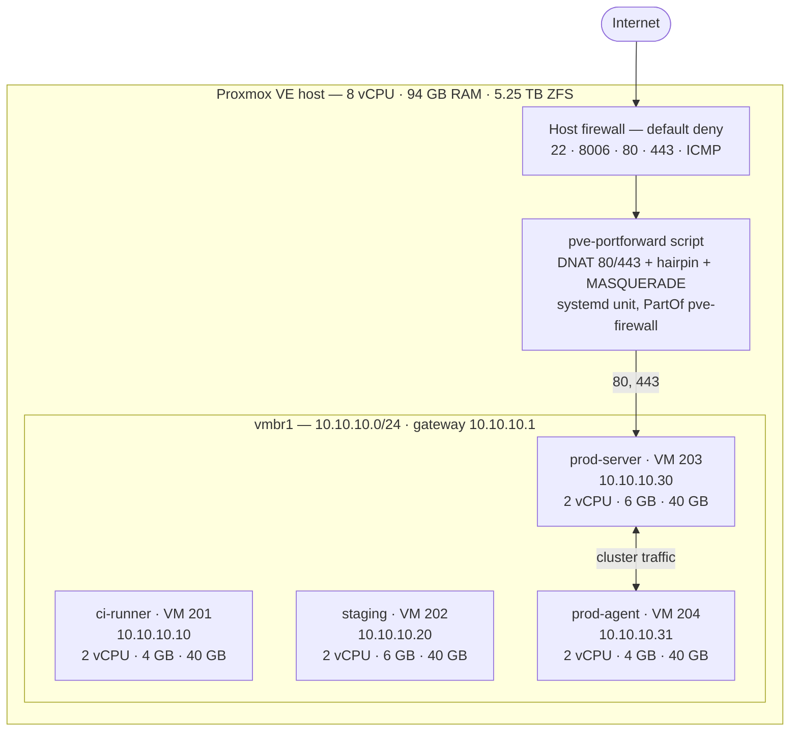
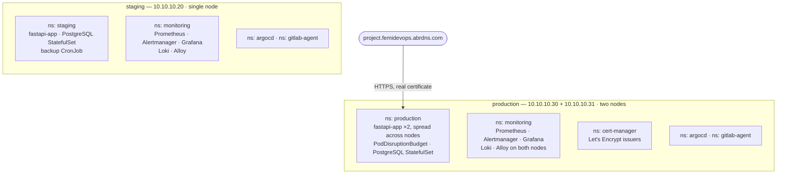
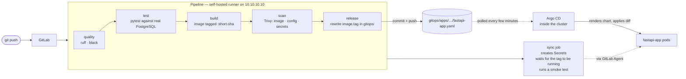
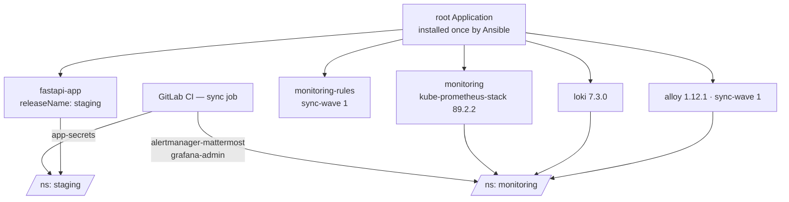
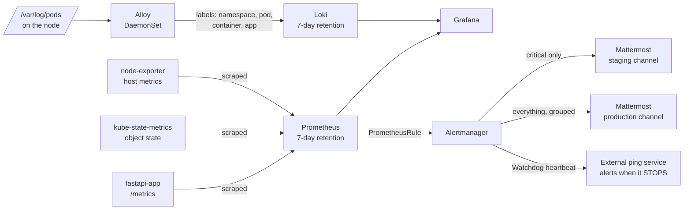
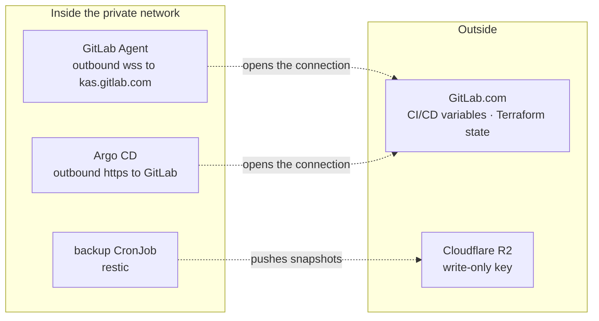
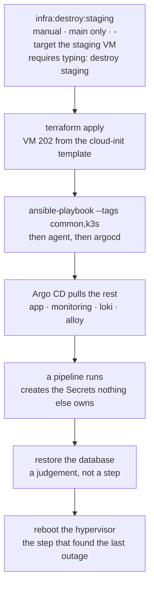
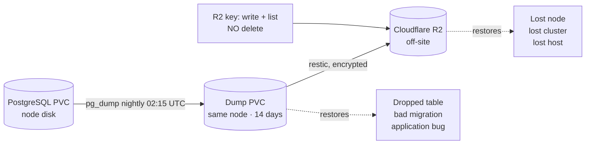
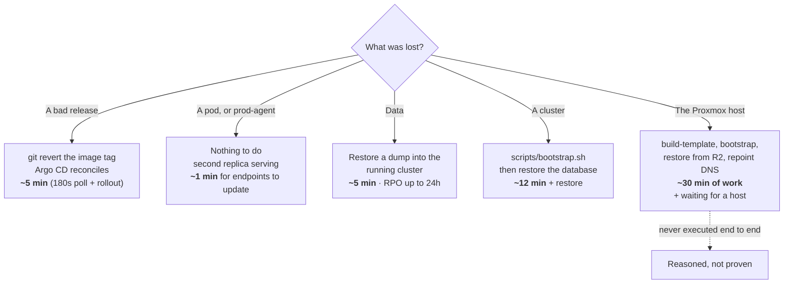

# Architecture Diagrams

Diagrams of the platform, from the host down to a single deployment. GitLab
renders them directly; no tooling needed.

---

## 1. One host, four VMs

Public traffic reaches exactly one VM. Every other machine is reached by SSH
through the host, which is why every Ansible connection uses a ProxyJump.
The port forwarding is one script, run by Ansible and by a systemd unit at
boot, so the rules that are tested are the rules that load. A saved
netfilter-persistent ruleset failed to load on every boot and nobody knew
until the first reboot.

---

## 2. Two separate clusters

Two application replicas remove the most common cause of downtime: one pod
dying. They change nothing about the database, the control plane, or the host.
The host NATs 80/443 to one address, so that node is still the only way in.

---

## 3. How code reaches production

Solid lines are pushes; dotted lines are pulls. Nothing outside the cluster
holds a credential that can change it — Argo CD and the GitLab Agent both
connect outward. The sync job exists because pushing a commit is a request,
not a result: it polls until the running image is the requested one, then
curls the service. Staging tracks `main`; production tracks the `production`
branch, so promotion is a merge and rollback is `git revert`.

---

## 4. What Argo CD manages, and what CI creates

Production's directory holds `fastapi-app`, `loki` and `alloy`; its Prometheus
stack is still installed by the Ansible `monitoring` role rather than Argo CD.

Secrets are deliberately outside `gitops/`: a secret in git is a secret
published, and anything that decrypts secrets *inside* the cluster dies with
the cluster, which defeats being able to rebuild it. The first rebuild drill
showed the cost: Argo CD reconciled perfectly and every pod sat in
`CreateContainerConfigError` for nine hours, because the Secret they all
reference is created by a pipeline that had failed. Argo CD guarantees what
is in `gitops/` and nothing else.

---

## 5. Metrics, logs and alerts

The Watchdog fires constantly, on purpose, to a service outside the cluster
that alerts when the heartbeat stops. Without it, a dead monitoring stack
looks the same as a healthy platform. Alerts cover symptoms (no ready
replicas, no recent backup, database down), not causes (CPU, memory,
restarts); causes belong on the dashboard.

---

## 6. Where credentials live

| Credential | Lives in | Scoped to |
| --- | --- | --- |
| Proxmox API token | GitLab CI/CD variable | Terraform's own PVE user |
| Terraform state auth | `CI_JOB_TOKEN`, per job | Nothing long-lived |
| GitLab Agent token | A Secret inside each cluster | One cluster |
| Agent RBAC | Role, not ClusterRole | One namespace, plus two named Secrets in `monitoring` |
| CI SSH key | Protected CI/CD variable | Separate from the operator's key |
| R2 backup key | Secret in `production` | Write and list — **cannot delete** |

The R2 key cannot delete. Ransomware and mistakes both delete backups, so
the off-site copy is written with a key that cannot destroy it. Pruning is
manual from a trusted machine as a consequence.

---

## 7. Rebuilding staging from scratch

The first run of this drill found five defects, every one invisible on a
machine that had been alive for weeks — a rollout wait that assumed Traefik
already existed, a missing `helm` two roles had silently relied on, a kubectl
apply the agent proxy refused, workloads that could not start without CI's
Secrets, and an agent token that died with the cluster while GitLab kept the
registration. All five are fixed in code; the list lives in
[rebuild-staging.md](rebuild-staging.md).

---

## 8. Backups and what each copy protects

A dump on the same disk as the database covers human error and nothing else —
if that disk goes, both go together. The off-site copy is what makes the
second column survivable. The R2 credential cannot delete, so the cluster
that writes the backups cannot destroy them; pruning is a manual job from a
trusted machine as a result.

---

## 9. Recovery paths

The rebuild figure is built from timed pipeline stages: `terraform plan` 14s,
`terraform apply` 59s, Ansible common and k3s 2m 26s, Argo CD filling the
cluster 3m 30s, plus about five minutes of smaller steps. Image pulls dominate
the two longest of those. Full breakdown, and which parts are measured rather
than estimated, in [disaster-recovery.md](disaster-recovery.md).

Three points the diagram makes that are easy to miss. Losing **prod-agent** is
survivable and losing **prod-server** is not, because the host NATs 80/443 to
that node and the control plane lives there. The host-loss figure counts only
the work — obtaining a host is the provider's time and no design choice of
ours shortens it. And that path is the only one never carried out, which is
why it is drawn differently.

**Deciding is not included in any of these.** Choosing which dump to restore
can take longer than the restore, and that is a human judgement rather than a
system property.

---

## 10. What is not built, and why

These are decisions, not gaps. Each one was made for a reason.

| Not built | Because |
| --- | --- |
| Database HA | A single host cannot provide it; a replica on the same machine protects against nothing that matters |
| TLS on staging | Staging is not reachable from the internet |
| Automatic off-site pruning | The cluster's bucket key cannot delete, on purpose |
| Logs on production | The collector runs as root to read host files; staging carries that risk first |
| Blue/green or canary | Rolling updates with a readiness probe and a disruption budget are enough at this size |
| A hypervisor console | Not available — it belongs to the provider. A real limitation, stated rather than discovered under pressure |
